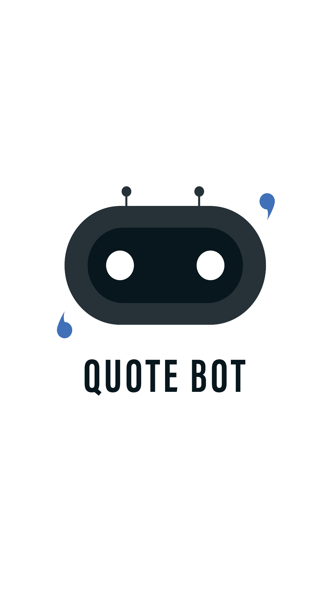
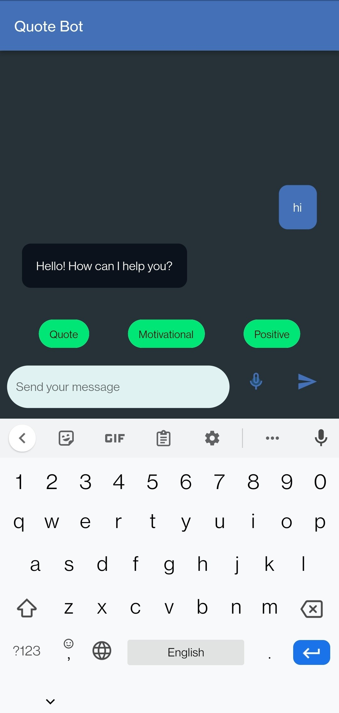
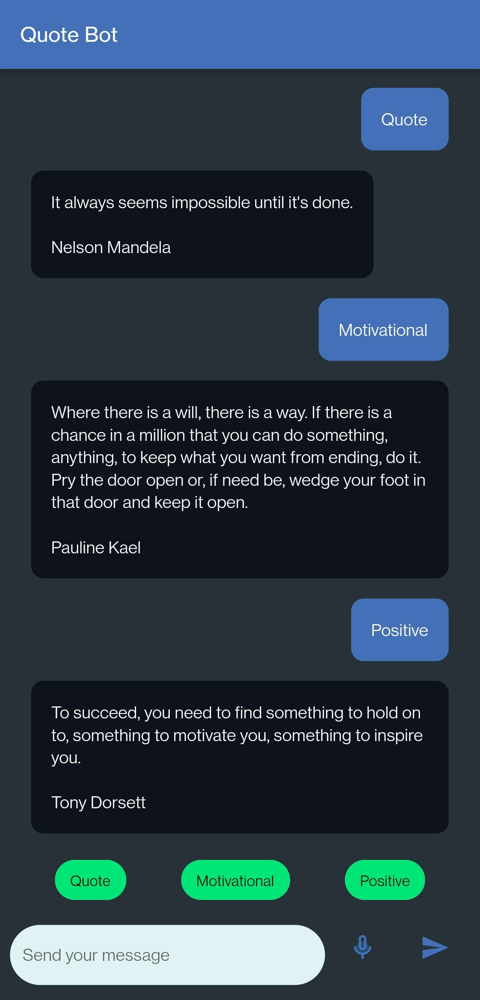

# Flutter Bot - Quote bot

Flutter Bot provides quotes. 
It is an interactive bot that gives result based on users preference.

## Language and API

    - Flutter
    - Dart
    - Dialogflow

## Features

    - Text message
    - Suggestions
    - Audio to text message

## Plugins

    1.	flutter_dialogflow - v0.1.3
    2.	flutter_launcher_icons - v0.8.1
    3.	flutter_launcher_name - v0.0.1
    4.	speech_to_text - v3.1.0
    5.	avatar_glow - v1.2.0

## Screenshots

 
 
 

## 🔗 Links

